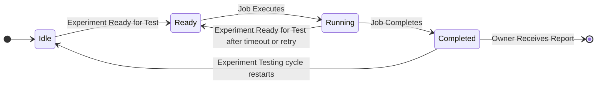
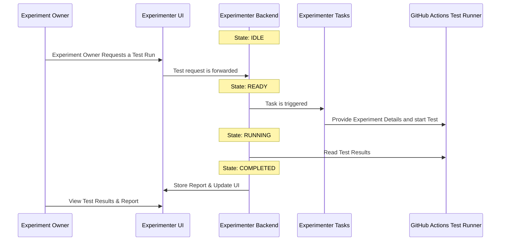
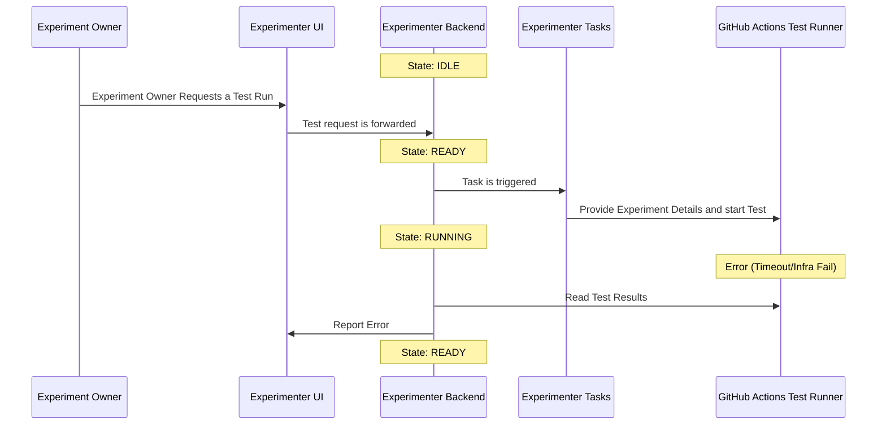

# Nimbus Integration

This file contains a set of sequence diagrams to describe the integration of Klaatu into the Nimbus project.

## State Diagram

Klaatu follows a structured lifecycle, transitioning through defined states as experiments progress through testing. The system starts in the IDLE state, waiting for an experiment to be scheduled or requested for testing. Once an experiment is ready, it transitions to the READY state, preparing for execution. When testing begins, the Experiment's testing status moves into the RUNNING state, actively executing tests and collecting results. After execution, the Experiment's testing status transitions to the COMPLETED state, where results are finalized and made available in the Experimenter UI. Once complete, the experiment will remain
in the COMPLETED state if testing has been successful. If the testing has errored in any way, the experiment will be put in a READY state, waiting for the next testing opportunity.

## Triggered Run (Trigger/Test/Report)

An Experiment has automated testing requested. Experimenter's Backend prepares the configuration and triggers a Task. The Task forwards the test config to GitHub actions to execute the tests. The test results are pushed to Experimenter where they are processed and then provided to the UI. Experimenter also sends a notification to the Experiment Owner of the test results.

## Error (Trigger/Test/Error/Report)

An Experiment has automated testing requested. Experimenter's Backend prepares the configuration and triggers a Task. The Task forwards the test config to GitHub actions to execute the tests. The test runner encounters an error. Experimenter reports the error to the UI.

