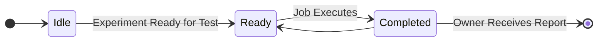
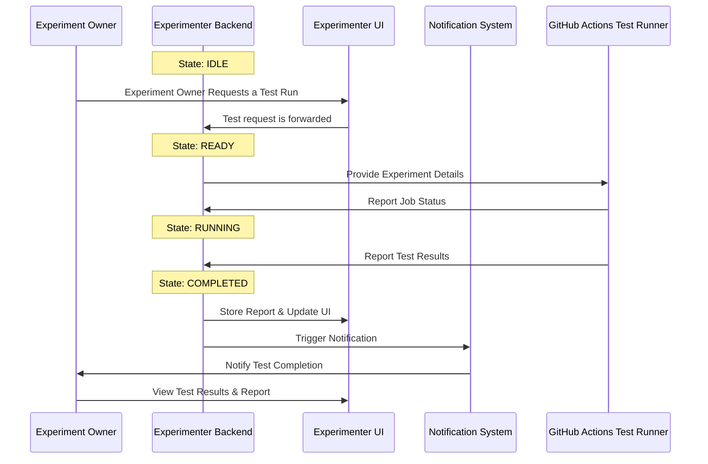
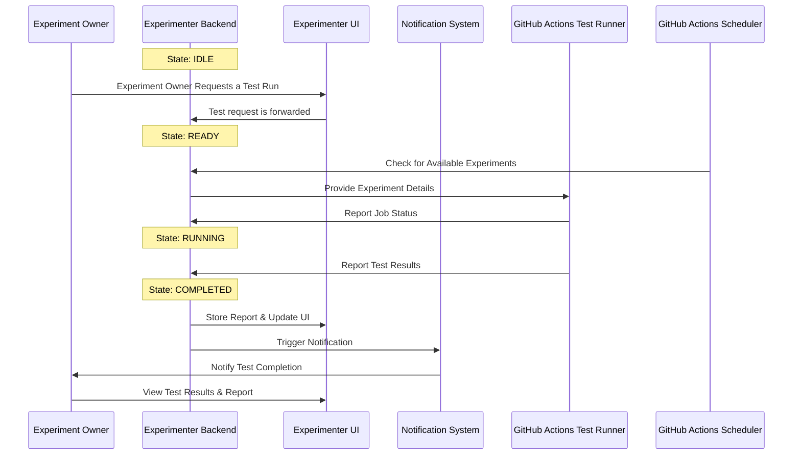
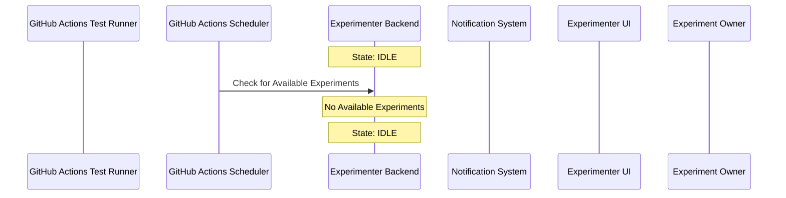
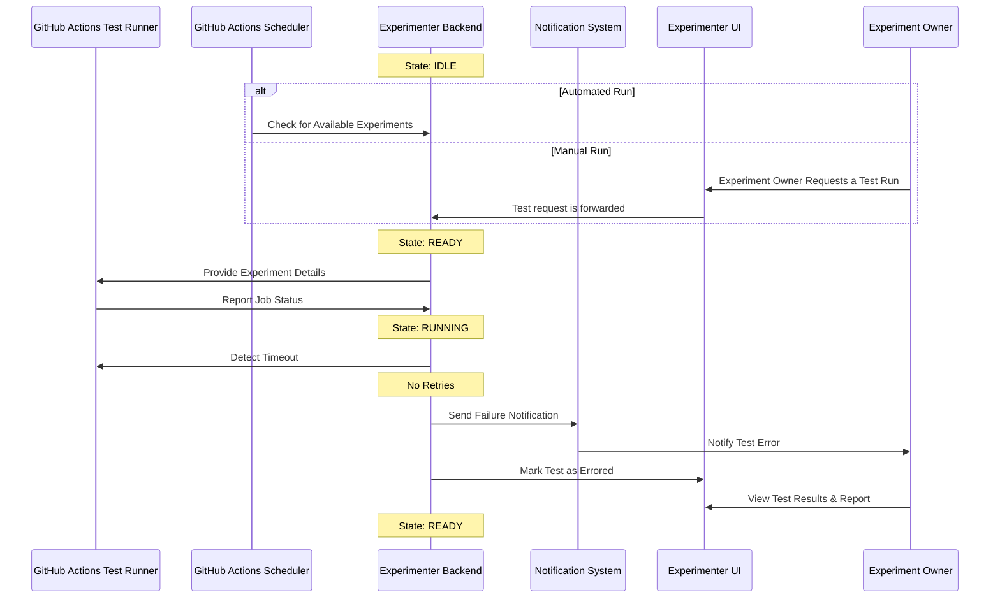
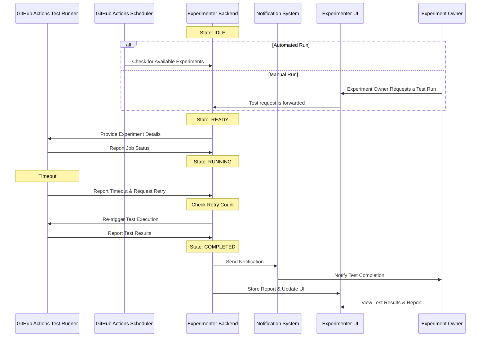
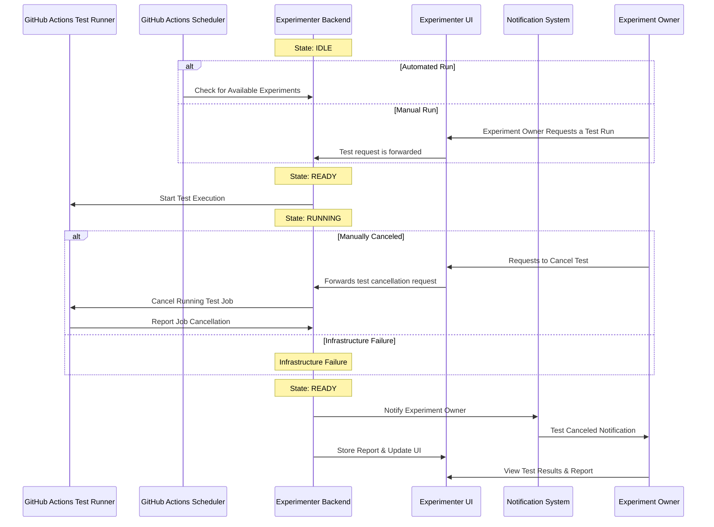

# Nimbus Integration

This file contains a set of sequence diagrams to describe the integration of Klaatu into the Nimbus project.

## State Diagram

These are the available states and flows that Klaatu can execute. The system follows a structured lifecycle, transitioning between states as experiments are scheduled for testing, testing execution, test result evaluation and test reports are finalized. It starts in an Idle state, waiting for an available experiment or for an experiment to have testing requested on it. Once an experiment is requested, it moves into the Running state, where tests are actively executed. Upon completion, results are processed in the Evaluating state, determining success, failure, or retry conditions. Finally, once results are stored and available in the Experimenter UI, the system transitions back to Idle, ready for the next experiment.

## Triggered Run

The Experiment Owner requests a test run. Experimenter gathers the required information and triggers the GitHub Actions Test Runner to execute the tests. The test results are pushed to Experimenter where they are processed and then provided to the UI. Experimenter also sends a notification to the Experiment Owner of the test results.

## Github Scheduler (Trigger/Test/Report)

The GitHub Actions Scheduler queries the experimenter API and finds experiments to test. It then triggers the GitHub Actions Test Runner to execute the tests. The test results are pushed to Experimenter where they are processed and then provided to the UI. Experimenter also sends a notification to the Experiment Owner of the test results.

## Github Scheduler No Available Experiments (Trigger/Query)

The GitHub Actions Scheduler queries the experimenter API and finds experiments to test. There are no available experiments to test.

## Timeout and No Retry (Trigger/Test/No Retry/Report)

The GitHub Actions Test Runner is triggered to run the tests. The test runner encounters an error and is NOT able to retry the job. The test is marked as a failure and the results are pushed to Experimenter where they are processed and then provided to the UI. Experimenter also sends a notification to the Experiment Owner of the test results.

## Timeout and Retry (Trigger/Test/Timeout/Retry/Report)

The GitHub Actions Test Runner is triggered to run the tests. The test runner encounters a timeout and is able to retry the job. The test results are pushed to Experimenter where they are processed and then provided to the UI. Experimenter also sends a notification to the Experiment Owner of the test results.

## Cancelled (Trigger/Cancelled)

The GitHub Actions Test Runner is triggered to run the tests. The job is cancelled by the Experiment Owner while it is being executed. The GitHub Actions Test Runner halts execution and reports a cancellation. The results are pushed to Experimenter where they are processed and then provided to the UI. Experimenter also sends a notification to the Experiment Owner of the test results.

