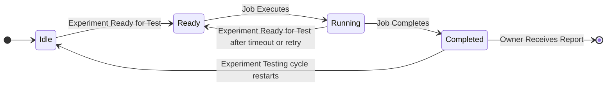
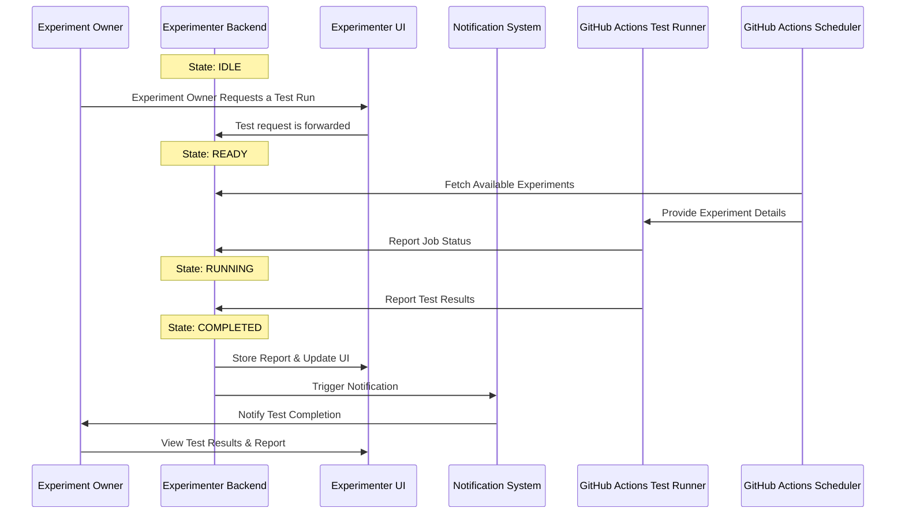
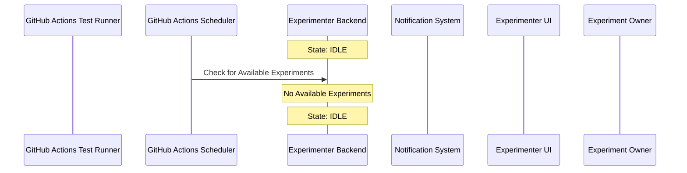
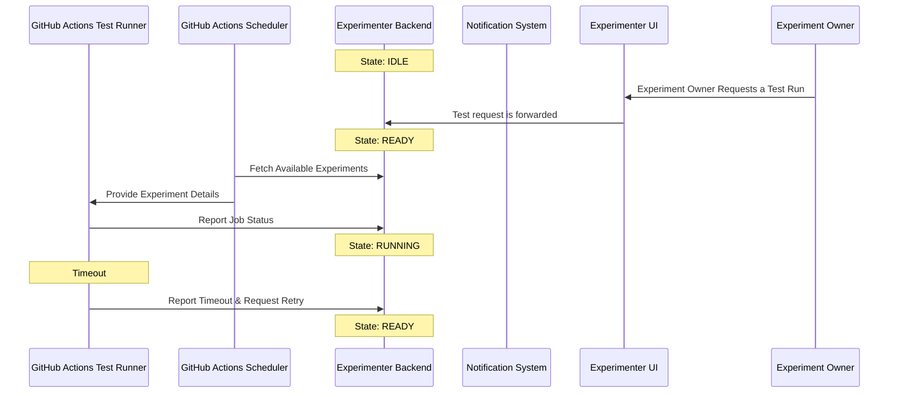
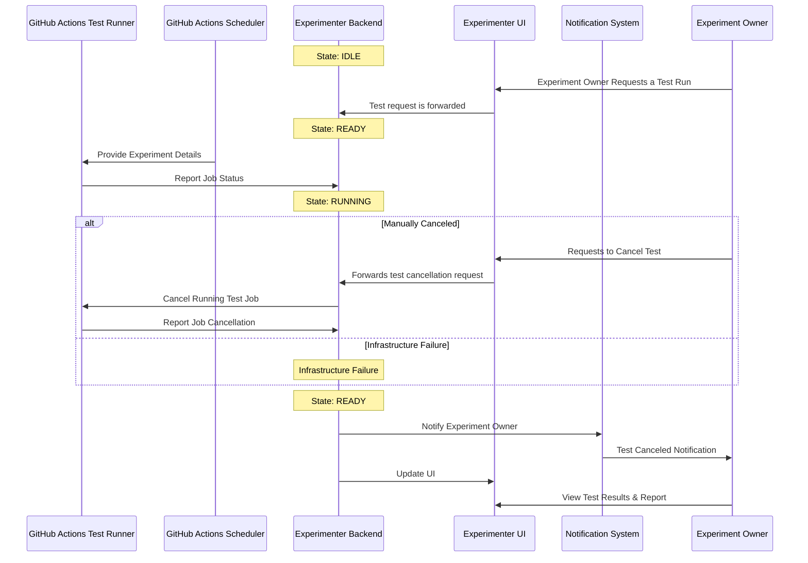

# Nimbus Integration

This file contains a set of sequence diagrams to describe the integration of Klaatu into the Nimbus project.

## State Diagram

Klaatu follows a structured lifecycle, transitioning through defined states as experiments progress through testing. The system starts in the IDLE state, waiting for an experiment to be scheduled or requested for testing. Once an experiment is ready, it transitions to the READY state, preparing for execution. When testing begins, the Experiment's testing status moves into the RUNNING state, actively executing tests and collecting results. After execution, the Experiment's testing status transitions to the COMPLETED state, where results are finalized and made available in the Experimenter UI. Once complete, the experiment will remain
in the COMPLETED state if testing has been successful. If the testing has errored in any way, the experiment will be put in a READY state, waiting for the next testing opportunity.

## Github Scheduled Run (Trigger/Test/Report)

The GitHub Actions Scheduler queries the experimenter API and finds experiments to test. It then triggers the GitHub Actions Test Runner to execute the tests. The test results are pushed to Experimenter where they are processed and then provided to the UI. Experimenter also sends a notification to the Experiment Owner of the test results.

## Github Scheduler No Available Experiments (Trigger/Query)

The GitHub Actions Scheduler queries the experimenter API and finds experiments to test. There are no available experiments to test.

## Timeout and Retry (Trigger/Test/Timeout/Retry/Report)

The GitHub Actions Test Runner is triggered to run the tests. The test runner encounters a timeout and is able to retry the job. The test results are pushed to Experimenter where they are processed and then provided to the UI. Experimenter also sends a notification to the Experiment Owner of the test results.

## Cancelled (Trigger/Cancelled)

The GitHub Actions Test Runner is triggered to run the tests. The job is cancelled by the Experiment Owner while it is being executed. The GitHub Actions Test Runner halts execution and reports a cancellation. The results are pushed to Experimenter where they are processed and then provided to the UI. Experimenter also sends a notification to the Experiment Owner of the test results.

